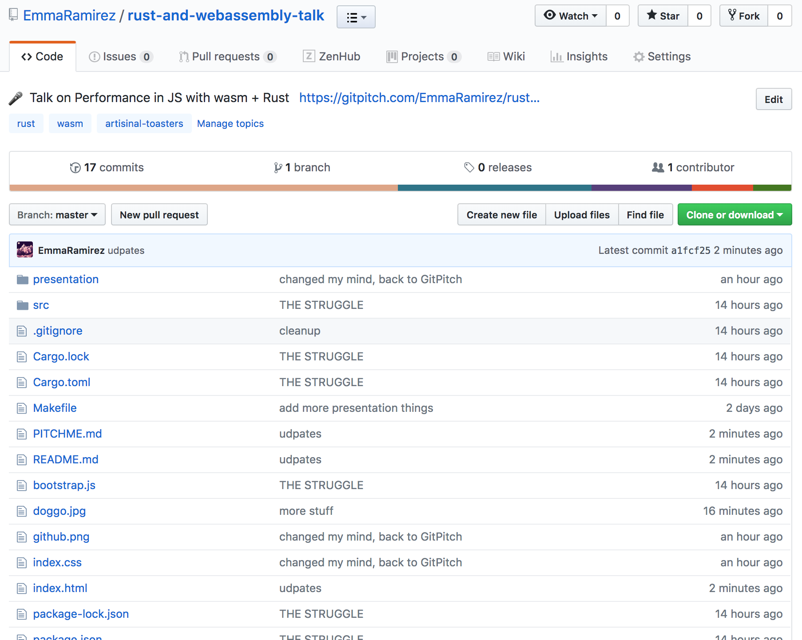
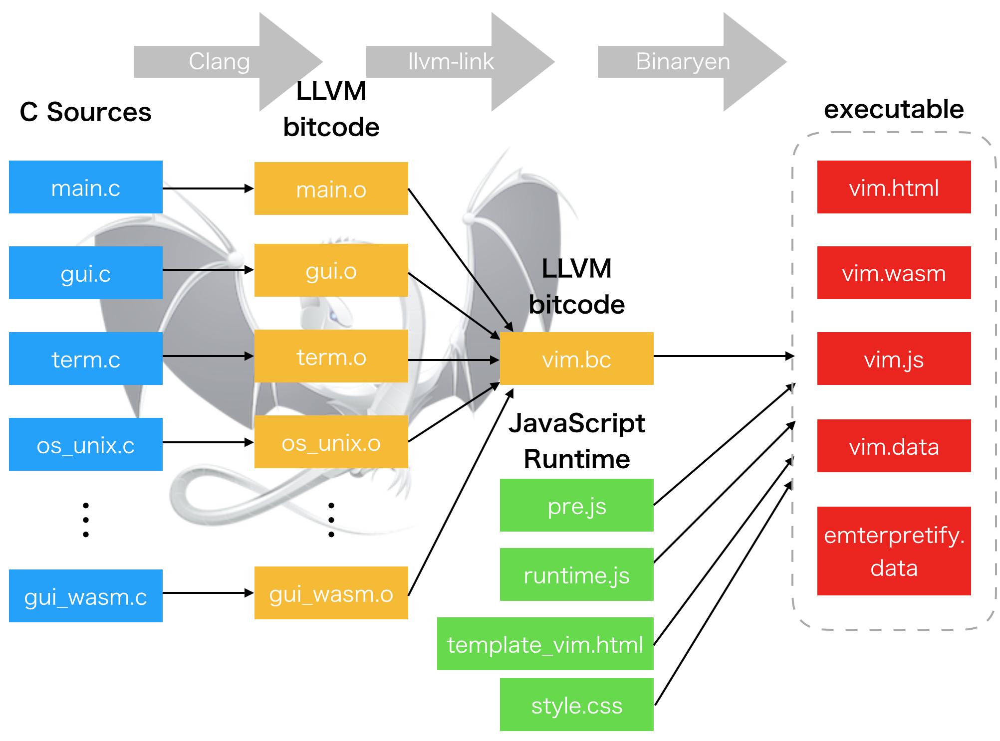
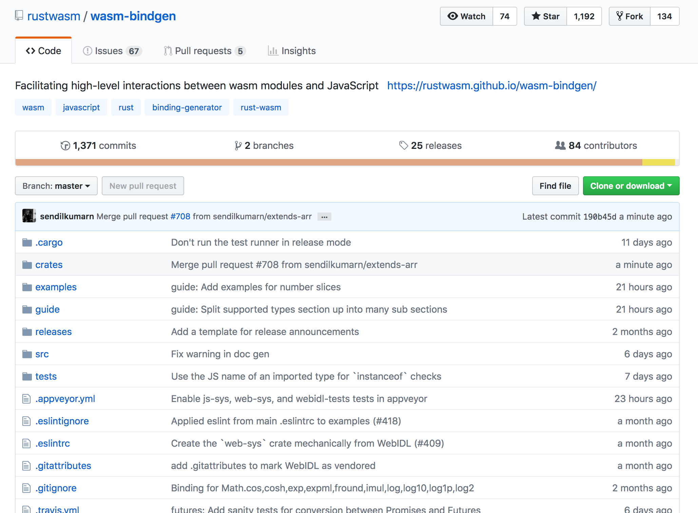

# Assembling the Web 

### 🦀 + 🕸

####  [@EmmaGRamirez](https://twitter.com/EmmaGRamirez) |  [EmmaRamirez](https://github.com/EmmaRamirez)


---


---

## Follow Along!

[✨ click here ✨](https://github.com/EmmaRamirez/rust-and-webassembly-talk)



---

## A Brief History of Trying to Embed Things in JavaScript

- Java Applets
- Asm.js

---

## Things to Know About JS

- JS is dynamic
- JS uses garbage collection
    - Eventually we'll have to use the host-binding proposal
- JS is incredibly optimized

---

# JS Performance

---


by Lin Clark

---


by Lin Clark

---


---

## Why Wasm?

- Part of the [Open Web Platform](https://github.com/webassembly/design)
    - Designed by representatives from major browser vendors
    - Itself platform agnostic
- Memory Safe (sandboxed)
- Achieves high performance
- Small, portable size

---

## Contrived Canonical Example

### Rust

```rust
#[no_mangle]
pub extern "C" fn add_one(x: i32) -> i32 {
    x + 1
}
```

---

### Wasm

```rust
(module
  (type $t0 (func (param i32) (result i32)))
  (func $add_one (export "add_one") (type $t0) (param $p0 i32) (result i32)
    get_local $p0
    i32.const 1
    i32.add)
  (table $T0 1 1 anyfunc)
  (memory $memory (export "memory") 17))
```

---

### JS "Bridge"

```javascript
const container = document.getElementById('container');
fetch('../out/main.wasm')
    .then(response =>
        response.arrayBuffer()
    )
    .then(bytes => WebAssembly.instantiate(bytes))
    .then(results => {
        instance = results.instance;
    container.innerText = instance.exports.add_one(41);
}).catch(console.error);
```

---

# Is WASM going to replace JS?

---

<iframe src="https://giphy.com/embed/12XMGIWtrHBl5e" width="480" height="392" frameBorder="0" class="giphy-embed" allowFullScreen></iframe><p><a href="https://giphy.com/gifs/the-office-no-steve-carell-12XMGIWtrHBl5e"></p>

---

## Limitations of Wasm

Wasm modules can only call functions that deal with:

- i32
- i64
- f32
- f64

Wasm is supported in all major browsers, but the spec is still developing. (However new iterations will be fully backwards compatible!)

---

## Why Rust?

```shell
cargo build --target wasm-unknown-unknown
```

- Fast, on par with C++
- Memory-safe
- Thread-safe

---

## Game of Life

---

# 


---

## Raytracer

---

## Vim

---



---

https://twitter.com/jxxf/status/1027358517462626304


- Used 8 different systems with 8 different adapters to produce an insurance quote
- Coordinator process was CPU-expensive
- Instead of offloading that work to AWS, switched to wasm written in Rust
- Now the user just submits, waits for "processing..." for 15 seconds, then done!
- Took 2 weeks. Saved $1.3 million

---

## Tools & Ecosystem

---

## `wasm-bindgen`



---

## `js-sys`

Get access to API from the ECMAScript standard without having to write them by hand with bindgen.

```rust
extern crate js_sys;
extern crate wasm_bindgen;
use wasm_bindgen::prelude::*;
#[wasm_bindgen]
pub fn timed(callback: &js_sys::Function) -> f64 {
    let then = js_sys::Date::now();
    callback.apply(JsValue::null(), &js_sys::Array::new()).unwrap();
    let now = js_sys::Date::now();
    now - then
}
```

---

## Things to Keep in Mind

- Glue Code
- Native Addons
- Ecosystem Maturity

---

## Other Possibilities

- C/C++
- Assemblyscript
- Turboscript
- Grain...and others!

--- 

## The Future

- Host bindings
- Garbage collection
- SIMD
